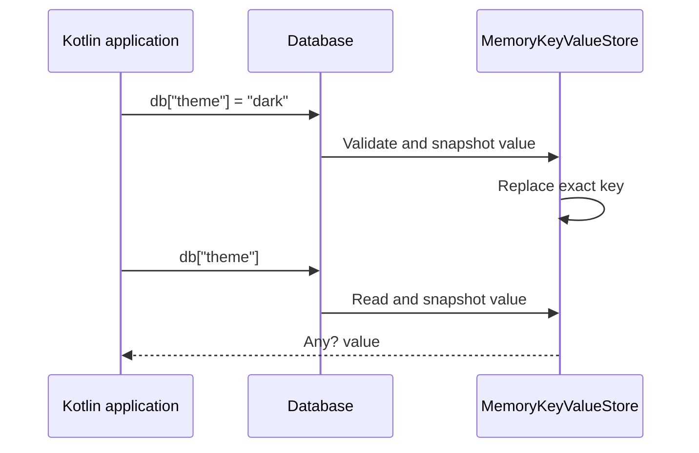

# KokoDB

Everything you need for a small database, in one simple Kotlin library.

KokoDB is an open-source project aiming to build a lightweight embedded database for Kotlin/JVM that feels like using a map.

The primary API is `db[key] = value` and `db[key]`. Store small pieces of application data without defining model classes, tables, annotations, or mappers.

The ultimate goal is a simple, low-overhead local database for Kotlin applications. The current implementation is memory-only; persistent storage is not implemented yet.

## Getting started

```kotlin
import kokodb.Database

val db = Database.inMemory()
db["theme"] = "dark"
db["retryCount"] = 3

val theme = db["theme"]
val retryCount = db["retryCount"]

check(theme == "dark")
check(retryCount == 3)
```

Lookups return `Any?`: a string key does not encode the stored value's Kotlin type. When a typed value is needed, use Kotlin's casts or type checks, for example `db["theme"] as? String`.

## Key-value contracts

- Keys are exact, case-sensitive strings. Empty strings, spaces, and Unicode are supported.
- Values may be String, Boolean, Byte, Short, Int, Long, Float, Double, Char, ByteArray, or null. Their exact Kotlin types are preserved.
- Assigning an existing key replaces its value, including with a different supported type.
- Missing keys and stored null values both read as null. Use `"theme" in db` to check whether a key exists.
- `db.remove("theme")` removes a key and returns its previous value, or null if missing or previously null.
- Byte arrays are copied on writes and reads. Mutating an input or returned array does not change stored data.
- Unsupported objects and collections throw `DatabaseException` before changing the store. Arbitrary-object serialization is not implemented.
- Each database instance has its own memory store. Values are not persisted across application restarts, and concurrent access is unsupported.
- Key-value entries have a separate namespace from SQL tables and generated models. They are not SQL rows or model records.

## Build and run

Requires JDK 17. The Gradle Wrapper downloads the pinned Gradle distribution on first use.

```sh
./gradlew build :sample-kv:run
```

The `sample-kv` module depends only on the runtime library and uses no KSP plugin, annotations, or generated models. Inside this checkout its dependency is:

```kotlin
dependencies {
    implementation(project(":"))
}
```

Artifacts are not published yet. Tests verify value types, null behavior, overwrites, removals, byte-array isolation, failed-write preservation, and randomized comparison against a map reference model.

## Architecture



The key-value path goes directly from operator methods to the instance's `MemoryKeyValueStore`. The store currently wraps a map, validates supported value types, and copies mutable byte arrays at its boundaries. It does not pass through SQL parsing, model mapping, or relational execution. Persistence and recovery are future engine work.

## Additional interfaces

The existing SQL, typed Table/Column DSL, and generated model APIs remain available as additional interfaces. They use the relational catalog and executor, independently of key-value entries.

- SQL supports `CREATE TABLE`, single-row `INSERT`, and `SELECT` with projections and a single equality condition over non-null INT/TEXT values.
- The typed DSL supports schema declarations, checked insertion, equality predicates, and explicit row mapping.
- `@DbTable` models support generated schemas, automatic discovery, and object mapping. This interface requires the KSP plugin and `ksp(project(":processor"))` in modules declaring annotated models.
- The `sample` module demonstrates the model API; run it with `./gradlew :sample:run`.

The runtime module contains all database APIs and in-memory storage. The `processor` module is build-time support for the optional model API and is not a runtime dependency. No JDBC or separate server is required.
