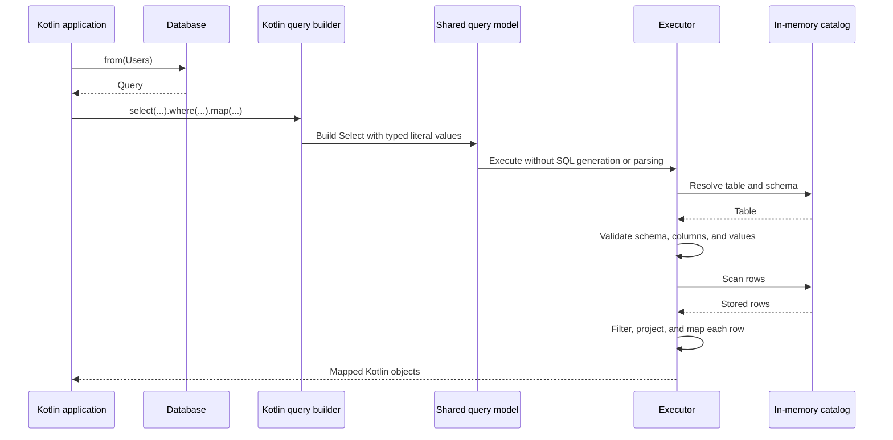

# KokoDB

Everything you need for a small SQL database, in one simple Kotlin library.

KokoDB is an open-source project aiming to build a lightweight embedded SQL database that is simple to use in Kotlin/JVM applications.

It aims to provide data storage, SQL execution, parameter binding, and result mapping to Kotlin objects in a single library, without a separate database server or JDBC.

The ultimate goal is to give Kotlin developers who need a small database an option that is easy to adopt and use, with minimal dependencies and low resource overhead.

## Getting started

The current prototype runs in memory. Define a schema and use the typed Kotlin DSL:

```kotlin
import kokodb.Database
import kokodb.Table

object Users : Table("users") {
    val id = int("id")
    val name = text("name")
}

data class User(val id: Int, val name: String)

val db = Database.inMemory()
db.createTable(Users)
db.insertInto(Users) {
    set(Users.id, 1)
    set(Users.name, "Koko")
}

val users: List<User> = db.from(Users)
    .select(Users.id, Users.name)
    .where(Users.id eq 1)
    .map { User(it[Users.id], it[Users.name]) }

check(users.single() == User(1, "Koko"))
```

`Column<T>` is invariant: inserting or comparing an incompatible value, or assigning a typed result to an incompatible Kotlin variable, fails to compile. Column ownership, projection membership, completeness of inserted rows, and compatibility with the stored schema are checked at runtime.

The SQL API uses the same tables and execution engine:

```kotlin
db.execute(
    "INSERT INTO users VALUES (:id, :name)",
    mapOf("id" to 2, "name" to "Other")
)
val rows = db.query("SELECT name FROM users WHERE id = :id", mapOf("id" to 2))
check(rows.single()[Users.name] == "Other")
```

## Kotlin DSL contracts

- `int()` and `text()` define non-null `Column<Int>` and `Column<String>` values. Names are normalized to lowercase; definitions freeze on first database use.
- `createTable()` creates a table with the declared columns. SQL-created tables can be used with the DSL when their ordered names and types exactly match the Kotlin definition.
- `insertInto()` requires one assignment per declared column in any order. Missing, duplicate, or foreign assignments fail without inserting a row.
- `from()` starts an immutable query selecting all columns. `select()` chooses columns from the same definition, and `where()` sets one equality predicate, replacing any previous predicate.
- `toList()` returns detached rows; `map()` transforms each row during execution without building an intermediate result list. Each terminal call reads the current database state; do not mutate the database inside a mapper.
- `row[column]` returns the column's Kotlin type. The source table name, selected column, and value type are checked; SQL results also support typed access.
- Object mapping is explicit. No reflection, annotations, generated model classes, or automatic mapping are required.

## Supported behavior

- SQL: `CREATE TABLE`, single-row `INSERT INTO ... VALUES (...)`, and `SELECT` with `*` or named columns and an optional single equality condition.
- Values: `INT` (Kotlin `Int`, signed 32-bit) and `TEXT` (Kotlin `String`). String literals escape quotes with `''`; `NULL` and implicit type conversions are unsupported.
- Names: ASCII identifiers (`[A-Za-z_][A-Za-z0-9_]*`); keywords, table names, and column names are case-insensitive. Quoted identifiers are unsupported.
- Parameters: `:name` binds an `Int` or `String` as a value. Names are case-sensitive; missing parameters fail and unused parameters are ignored.
- Results: detached rows accessed through `getInt()` and `getString()`. Duplicate projected columns are rejected; row order is not guaranteed.
- Execution: one statement per call with an optional trailing semicolon. `execute()` returns 0 for table creation and 1 for insertion; `query()` accepts only `SELECT`.
- Errors: `DatabaseException` reports execution errors; `SqlSyntaxException.position` reports a zero-based character offset in the SQL string.

Each instance is isolated and intended for sequential use. Data lasts only as long as the instance; persistence, transactions, concurrent access, indexes, joins, and automatic object mapping are not implemented yet.

## Architecture



Both the SQL parser and the Kotlin DSL build the internal query model in `kokodb.query`. The parser handles syntax without accessing storage; DSL column types constrain the caller before lowering to that model. The executor validates schemas, resolves names and types, and scans or inserts rows. The catalog stores schemas and rows without interpreting SQL. Queries currently use a full table scan.

## Build and test

Requires JDK 17. The Gradle Wrapper downloads the pinned Gradle distribution on first use.

```sh
./gradlew build
```

Tests cover SQL and DSL interoperability, typed object mapping, schema validation, failure behavior, and reference-model comparisons. Compiler tests verify valid external usage and rejection of incompatible Kotlin types; the compiler dependency is test-only. GitHub Actions runs the build for pull requests and pushes to `main`.
