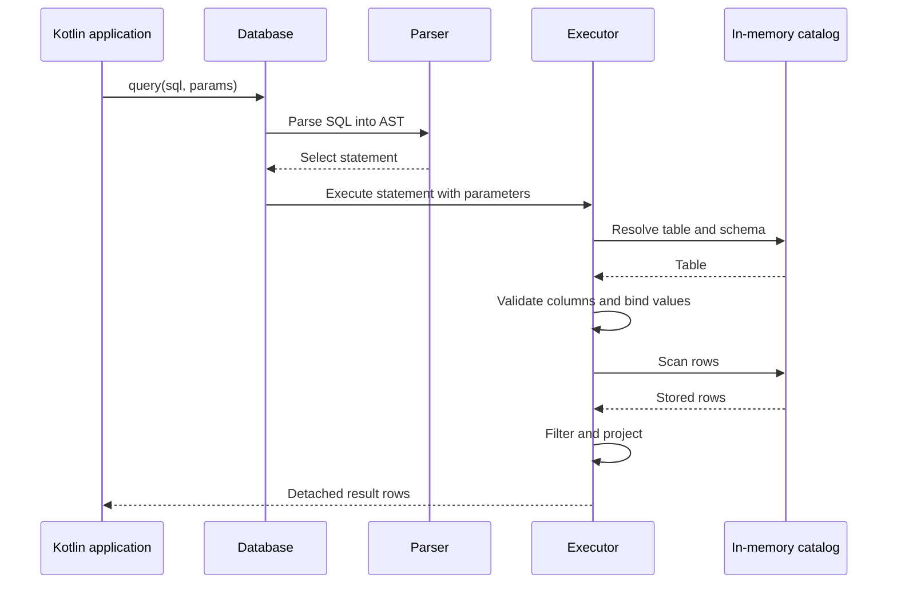

# KokoDB

Everything you need for a small SQL database, in one simple Kotlin library.

KokoDB is an open-source project aiming to build a lightweight embedded SQL database that is simple to use in Kotlin/JVM applications.

It aims to provide data storage, SQL execution, parameter binding, and result mapping to Kotlin objects in a single library, without a separate database server or JDBC.

The ultimate goal is to give Kotlin developers who need a small database an option that is easy to adopt and use, with minimal dependencies and low resource overhead.

## Getting started

The current prototype runs in memory and exposes a direct Kotlin API:

```kotlin
import kokodb.Database

val db = Database.inMemory()
db.execute("CREATE TABLE users (id INT, name TEXT)")
db.execute(
    "INSERT INTO users VALUES (:id, :name)",
    mapOf("id" to 1, "name" to "Koko")
)

val rows = db.query(
    "SELECT name FROM users WHERE id = :id",
    mapOf("id" to 1)
)
check(rows.single().getString("name") == "Koko")
```

## Supported behavior

- SQL: `CREATE TABLE`, single-row `INSERT INTO ... VALUES (...)`, and `SELECT` with `*` or named columns and an optional single equality condition.
- Values: `INT` (Kotlin `Int`, signed 32-bit) and `TEXT` (Kotlin `String`). String literals escape quotes with `''`; `NULL` and implicit type conversions are unsupported.
- Names: ASCII identifiers (`[A-Za-z_][A-Za-z0-9_]*`); keywords, table names, and column names are case-insensitive. Quoted identifiers are unsupported.
- Parameters: `:name` binds an `Int` or `String` as a value. Names are case-sensitive; missing parameters fail and unused parameters are ignored.
- Results: detached rows accessed through `getInt()` and `getString()`. Duplicate projected columns are rejected; row order is not guaranteed.
- Execution: one statement per call with an optional trailing semicolon. `execute()` returns 0 for table creation and 1 for insertion; `query()` accepts only `SELECT`.
- Errors: `DatabaseException` reports execution errors; `SqlSyntaxException.position` reports a zero-based character offset in the SQL string.

Each instance is isolated and intended for sequential use. Data lasts only as long as the instance; persistence, transactions, concurrent access, indexes, joins, and automatic object mapping are not implemented yet.

## Architecture



The parser handles syntax without accessing storage. The executor resolves names and types before scanning or inserting. The catalog stores schemas and rows without interpreting SQL. Queries currently use a full table scan.

## Build and test

Requires JDK 17. The Gradle Wrapper downloads the pinned Gradle distribution on first use.

```sh
./gradlew build
```

Integration tests cover the public API, SQL parsing, binding, type checking, and failure behavior. GitHub Actions runs the build for pull requests and pushes to `main`.
