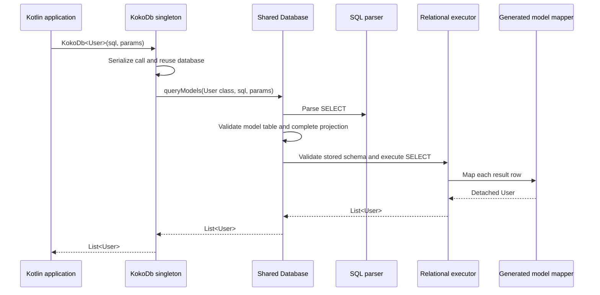

# KokoDB

Everything you need for a small SQL database, in one simple Kotlin library.

KokoDB is an embedded relational database for Kotlin/JVM. Its primary query API is `KokoDb<Model>(sql, params)`: write SQL and receive Kotlin objects from a shared database, without JDBC, a separate server, or a required repository layer.

The goal is a small, easy-to-adopt database with minimal dependencies and low resource overhead. Storage is currently memory-only; disk persistence is not implemented.

## Getting started

Declare the result model. KSP generates its table schema and mapper; the database discovers the generated definitions and prepares the tables automatically.

```kotlin
import kokodb.DbTable
import kokodb.Id
import kokodb.KokoDb

@DbTable("users")
data class User(@Id val id: Int, val name: String)

KokoDb.execute(
    "INSERT INTO users VALUES (:id, :name)",
    params = mapOf("id" to 1, "name" to "Koko"),
)

val users: List<User> = KokoDb<User>(
    "SELECT id, name FROM users WHERE name = :name",
    params = mapOf("name" to "Koko"),
)

check(users == listOf(User(1, "Koko")))
```

`KokoDb` is an object, and the call syntax invokes its query operator. Calls reuse the same database rather than constructing a new database. The type argument describes one result row; the returned value is always `List<Model>`.

No application database wrapper, service class, repository declaration, or manual mapper is required. Use the same `KokoDb` API from different application functions.

## Query and model contracts

- `KokoDb<Model>(sql, params)` accepts SELECT and returns freshly reconstructed, detached model objects. Empty results return an empty list.
- Typed results currently require an `@DbTable` model and the KokoDB KSP processor. Ordinary unannotated DTOs, scalar result types, and arbitrary object mapping are not supported.
- Models must be public top-level non-generic data classes with public constructors and public non-null Int/String constructor properties. Computed properties are not stored.
- SELECT must use the model's table and include each stored property exactly once, or use `*`. Column order may differ from constructor order. Wrong tables, incomplete/duplicate projections, incompatible schemas, and invalid parameters fail even when no rows match.
- Typed partial projections, aliases, joins, aggregation, and sorting are not implemented. Use raw rows for supported partial projections.
- `@Id` optionally declares one caller-supplied Int/String primary key. Duplicate keys fail before insertion, including SQL insertion. A key is not required for typed queries.
- SQL identifiers are case-insensitive. String values and parameter names remain case-sensitive. Parameters bind Int/String values; null and implicit type conversion are unsupported.
- Input SQL and stored schemas are validated at execution time. Kotlin checks result assignment types, not SQL text.
- Mutating a returned model does not write to the database. There is no automatic dirty checking.

## Raw SQL

Raw SQL does not require a model declaration or KSP. Create schemas explicitly and receive detached Row values:

```kotlin
KokoDb.execute("CREATE TABLE settings (name TEXT PRIMARY KEY, value INT)")
KokoDb.execute(
    "INSERT INTO settings VALUES (:name, :value)",
    mapOf("name" to "count", "value" to 3),
)
val count = KokoDb.query("SELECT value FROM settings WHERE name = :name", mapOf("name" to "count"))
    .single().getInt("value")
```

`execute()` returns 0 for CREATE TABLE and 1 for INSERT. `query()` returns `List<Row>`; getters reject missing or mistyped columns. Typed and raw calls use the same catalog and engine.

## Shared database lifetime

- The first query or execute call opens the shared memory database lazily. Its model definitions come from the calling thread's context class loader, falling back to the library class loader.
- `KokoDb.openInMemory(classLoader)` can open it explicitly before use. Opening an already-active database fails rather than discarding its rows.
- `KokoDb.close()` discards the shared memory store. Calls then fail until `openInMemory()` explicitly opens a fresh store. Repeated closes are harmless, and previously returned results remain detached.
- Each shared API call is serialized. Concurrent callers cannot execute against the shared engine simultaneously; a sequence of calls is not a transaction.
- The singleton is shared within its loaded JVM class loader. It is not shared across processes or persisted across application restarts.

```kotlin
KokoDb.close()
KokoDb.openInMemory() // a fresh, empty store with generated model tables
```

For isolated databases or tests, use independent instances. These are intended for sequential use and do not share data with KokoDb:

```kotlin
import kokodb.Database

val db = Database.inMemory()
val users = db.queryModels(User::class.java, "SELECT * FROM users")
```

## Build setup

Requires JDK 17. The Gradle Wrapper downloads the pinned Gradle distribution on first use.

```sh
./gradlew build :sample:run
```

Artifacts are not published yet. The `sample` module demonstrates typed SQL calls from separate functions and the required consumer setup inside this checkout:

```kotlin
plugins {
    kotlin("jvm")
    id("com.google.devtools.ksp")
}

dependencies {
    implementation(project(":"))
    ksp(project(":processor"))
}
```

Enable KSP in modules declaring annotated models. The processor runs at build time and is not a runtime dependency. Raw SQL consumers only need the runtime library.

## Architecture



The parser builds a shared query representation. The executor validates schemas, resolves parameters, and scans or inserts rows in the in-memory catalog. Generated model mapping uses constructor calls rather than runtime constructor introspection. Mapping runs during the scan without building an intermediate List<Row>.

## Supported SQL and limitations

- CREATE TABLE with non-null INT/TEXT columns and optional column-level PRIMARY KEY.
- Single-row INSERT INTO ... VALUES (...).
- SELECT with `*` or named columns and an optional single equality condition.
- ASCII identifiers (`[A-Za-z_][A-Za-z0-9_]*`), signed 32-bit INT literals, TEXT literals escaped with `''`, and `:name` value parameters.
- One statement per call, with an optional trailing semicolon. Quoted identifiers and NULL are unsupported. Result order is unspecified.
- DatabaseException reports execution errors; SqlSyntaxException.position reports a zero-based offset in the SQL string.

Disk persistence, transactions, indexes, foreign keys, generated/composite keys, SQL UPDATE/DELETE, joins, and general-purpose result DTO mapping are not implemented. Lookups and primary-key checks currently scan rows.

Tests cover shared lifetime and reuse, typed SQL mapping and failures, parameter binding, detached results, concurrent facade calls, independent databases, compiler checks, and SQL execution, primary-key constraints, and generated model mapping. GitHub Actions runs the build for pull requests and pushes to main.
