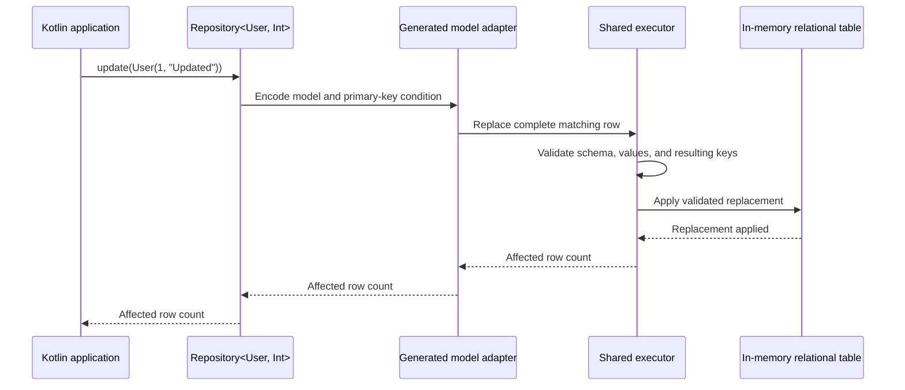
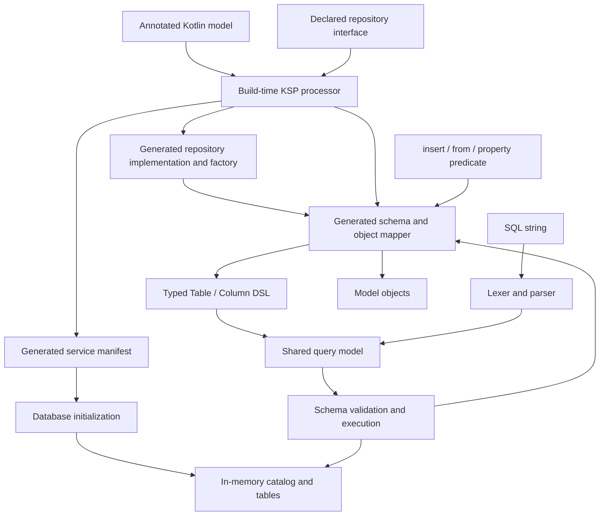

# KokoDB

Everything you need for a small SQL database, in one simple Kotlin library.

KokoDB is an open-source project aiming to build a lightweight embedded SQL database that is simple to use in Kotlin/JVM applications.

It aims to provide data storage, SQL execution, parameter binding, and result mapping to Kotlin objects in a single library, without a separate database server or JDBC.

The ultimate goal is to give Kotlin developers who need a small database an option that is easy to adopt and use, with minimal dependencies and low resource overhead.

## Getting started

Declare a model and repository interface. The processor generates the schema, object mapper, and repository implementation; opening a database automatically discovers model definitions and prepares the tables.

```kotlin
import kokodb.Database
import kokodb.DbRepository
import kokodb.DbTable
import kokodb.Id
import kokodb.Repository
import kokodb.eq

@DbTable("users")
data class User(@Id val id: Int, val name: String)

@DbRepository
interface UserRepository : Repository<User, Int>

val db = Database.inMemory()
val repository = UserRepository(db)
repository.insert(User(1, "Koko"))

val users: List<User> = repository.query()
    .where(User::id eq 1)
    .toList()

check(users.single() == User(1, "Koko"))
```

There is no per-model registration, manual table definition, table creation call, or row mapper in the normal model API.

## Model terminology

A model is a Kotlin type mapped to a relational table. Name it after the domain concept, such as `User` or `Order`, without a required `Entity`, `Model`, or `Record` suffix. A row is one stored entry; a table defines the relational schema.

Declare a named repository interface once. KSP generates its implementation and a same-name factory such as `UserRepository(db)`. The model and key types belong to the declaration; callers use the concrete repository contract.

Custom queries use ordinary Kotlin method bodies:

```kotlin
@DbRepository
interface UserRepository : Repository<User, Int> {
    fun named(name: String): List<User> = query().where(User::name eq name).toList()
}

class UserService(private val users: UserRepository) {
    fun register(id: Int, name: String): Int = users.insert(User(id, name))
}

val db = Database.inMemory()
val users = UserRepository(db)
val service = UserService(users)
```

Construct the database and repositories at the application's composition root, then inject repository interfaces into services. The generated factory binds to the supplied database; KokoDB does not provide a dependency-injection container or a global database instance.

## Repository contracts

```kotlin
repository.findById(1)                       // User?; null when absent
repository.update(User(1, "Updated"))       // 1 when present, 0 when absent
repository.findAll()                         // detached List<User>
repository.deleteById(1)                     // 1 when removed, 0 when absent
```

- Declare exactly one `@Id` constructor property when using a repository. Int and String keys are supported; callers supply their values. Keys are case-sensitive values, not identifiers.
- `@DbRepository` requires a public top-level non-generic interface directly extending `Repository<Model, ID>`. The processor checks that the model has `@DbTable`, exactly one `@Id`, and a matching ID type. Custom members require bodies; derived queries and overrides of inherited CRUD methods are unsupported.
- Models without `@Id` remain usable through `Database.insert()` and `Database.from<Model>()`. A generated repository requires its model adapter to be discoverable when opening the database.
- Models may be declared in a separate compiled module. Table and key annotations have binary retention so the repository processor can validate that model without runtime annotation scanning.
- Duplicate primary keys fail before mutation through SQL, model, and repository insertion alike. Key metadata is part of stored schema validation.
- `update(model)` replaces the complete row identified by that model's key. It does not insert an absent row, change another row's key, or perform automatic dirty checking. Use separate insert and update operations instead of an ambiguous save operation.
- Models and query results are detached. Mutating an input or returned object never writes to storage; call `update()` explicitly.
- Repository queries reuse the typed model query API. Each terminal call observes current data. Repositories for the same database and model share rows; separate database instances are isolated.
- Composite keys, generated keys, foreign keys, transactions, and disk persistence are not implemented. Lookups and key validation currently scan rows.



## Build setup

Code generation requires the KSP plugin and the KokoDB processor in each module declaring annotated models or repositories. Artifacts are not published yet; the `sample` module demonstrates the setup inside this checkout:

```kotlin
plugins {
    kotlin("jvm")
    id("com.google.devtools.ksp")
}

dependencies {
    implementation(project(":"))
    ksp(project(":processor"))
}
```

The root build pins Kotlin and KSP versions. Run the complete sample with `./gradlew :sample:run`. See [KSP setup](https://kotlinlang.org/docs/ksp-quickstart.html) for how processors are wired into a consumer build.

## Model API contracts

- `@DbTable` supports public top-level non-generic data classes with public constructors and public non-null Int/String constructor properties. Constructor property names become column names; computed properties are not stored.
- The processor emits schema and mapping code plus a `META-INF/services` provider manifest. `Database.inMemory()` discovers providers visible to the context class loader and prepares their tables in each new instance.
- `insert(model)` copies property values into storage. Query results are fresh model objects; mutating an inserted or returned object does not update the database.
- `from<Model>().where(Model::property eq value).toList()` returns full models. Property/value types and query model ownership are checked at compile time. Computed or otherwise unmapped properties fail at runtime.
- Each terminal call reads current data, and repeated `where()` calls replace the prior condition. Result order is unspecified.
- Unsupported model shapes and duplicate table names within a compilation fail during processing. Duplicate model adapters or table names across modules fail when opening the database.
- A missing generated adapter reports the required annotation and processor setup. Runtime model scanning and reflection-based constructor mapping are not used.

## Lower-level APIs

The explicit Table/Column DSL remains available for schema-oriented work and custom projections:

```kotlin
object Users : kokodb.Table("users") {
    val id = int("id")
    val name = text("name")
}

val db = Database.inMemory()
db.createTable(Users)
db.insertInto(Users) {
    set(Users.id, 1)
    set(Users.name, "Koko")
}
val names = db.from(Users).select(Users.name).map { it[Users.name] }
```

The SQL API uses the same tables and execution engine. After inserting a model, its values are also queryable through SQL:

```kotlin
val rows = db.query("SELECT name FROM users WHERE id = :id", mapOf("id" to 1))
check(rows.single().getString("name") == "Koko")
```

## Kotlin DSL contracts

- `int(name, primaryKey = true)` or `text(name, primaryKey = true)` declares a single-column primary key. `replaceIn(table, condition) { ... }` requires a complete row and rejects conflicting keys before mutation; `deleteFrom(table, condition)` removes matching rows. These operations return affected row counts and require a condition. SQL UPDATE and DELETE syntax is not implemented.
- `int()` and `text()` define non-null `Column<Int>` and `Column<String>` values. Names are normalized to lowercase; definitions freeze on first database use.
- `createTable()` creates a table with the declared columns. SQL-created tables can be used with the DSL when their ordered names, types, and primary-key metadata exactly match the Kotlin definition.
- `insertInto()` requires one assignment per declared column in any order. Missing, duplicate, or foreign assignments fail without inserting a row.
- `from()` starts an immutable query selecting all columns. `select()` chooses columns from the same definition, and `where()` sets one equality predicate, replacing any previous predicate.
- `toList()` returns detached rows; `map()` transforms each row during execution without building an intermediate result list. Each terminal call reads the current database state; do not mutate the database inside a mapper.
- `row[column]` returns the column's Kotlin type. The source table name, selected column, and value type are checked; SQL results also support typed access.
- Object mapping is explicit. No reflection, annotations, generated model classes, or automatic mapping are required.

## Supported behavior

- SQL: `CREATE TABLE` with optional column-level `PRIMARY KEY`, single-row `INSERT INTO ... VALUES (...)`, and `SELECT` with `*` or named columns and an optional single equality condition.
- Values: `INT` (Kotlin `Int`, signed 32-bit) and `TEXT` (Kotlin `String`). String literals escape quotes with `''`; `NULL` and implicit type conversions are unsupported.
- Names: ASCII identifiers (`[A-Za-z_][A-Za-z0-9_]*`); keywords, table names, and column names are case-insensitive. Quoted identifiers are unsupported.
- Parameters: `:name` binds an `Int` or `String` as a value. Names are case-sensitive; missing parameters fail and unused parameters are ignored.
- Results: detached rows accessed through `getInt()` and `getString()`. Duplicate projected columns are rejected; row order is not guaranteed.
- Execution: one statement per call with an optional trailing semicolon. `execute()` returns 0 for table creation and 1 for insertion; `query()` accepts only `SELECT`.
- Errors: `DatabaseException` reports execution errors; `SqlSyntaxException.position` reports a zero-based character offset in the SQL string.

Each instance is isolated and intended for sequential use. Data lasts only as long as the instance; persistence, transactions, concurrent access, indexes, joins, and automatic mapping for arbitrary classes are not implemented yet.

## Architecture



The root module contains runtime APIs, parsing, execution, and storage. The `processor` module generates model adapters and discovery resources at build time; it is not a runtime dependency. The `sample` module is a separate consumer that exercises the complete generated path.

Model and Table/Column APIs lower into `kokodb.query` directly. The SQL parser builds the same query model. The executor validates schemas, resolves names and types, and scans or inserts rows. The catalog stores schemas and rows without interpreting SQL. Model reconstruction uses generated constructor calls, and queries currently use a full table scan.

## Build and test

Requires JDK 17. The Gradle Wrapper downloads the pinned Gradle distribution on first use.

```sh
./gradlew build
```

Tests cover automatic model discovery and mapping, SQL/DSL interoperability, schema validation, failure behavior, and reference-model comparisons. Compiler tests verify valid external usage and rejection of incompatible Kotlin types; the compiler dependency is test-only. GitHub Actions runs the build for pull requests and pushes to `main`.

## Earlier key-value prototype

This checkout still contains a separate in-memory key-value API and the `sample-kv` module from an earlier prototype. They are not the product direction. Relational models and the shared SQL engine are the focus; general-purpose object serialization is not planned.
