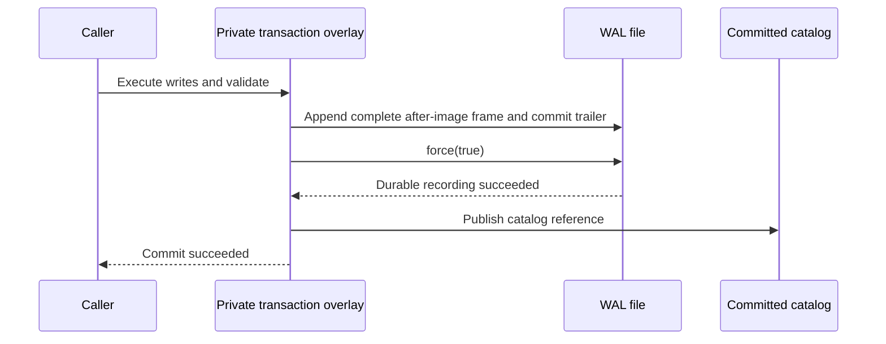

# Transactions and Persistence Design

Status: implemented development alpha. Memory SQL CRUD, synchronous transactions, version-one codecs, forced WAL commits, explicit checkpoints, ownership locks, and restart recovery are implemented. Release/platform compatibility gates remain explicit below.

## Goal and initial scope

- Keep `KoKoDB<Model>(sql, params)` as the primary SELECT API and `KoKoDB(sql, params)` as the write API.
- Support one database owner and serialized transactions, on the gated local filesystem types, subject to file and directory synchronization semantics.
- Keep the complete working catalog in memory. Use copy-on-write table snapshots rather than introducing pages, MVCC, or an optimizer in the first durable implementation.
- Guarantee that an acknowledged persistent commit survives restart under the supported filesystem/device synchronization assumptions.
- Recover each transaction completely or not at all, including transactions touching multiple tables or schemas.
- Exclude concurrent processes accessing the same database, distributed transactions, nested transactions/savepoints, coroutine transaction scopes, and automatic schema migration from the first implementation.

## Transaction contract

Implemented memory API:

```kotlin
KoKoDB.openInMemory()
KoKoDB.transaction {
    KoKoDB("UPDATE users SET name = :name WHERE id = :id", mapOf("name" to "Koko", "id" to 1))
    KoKoDB("DELETE FROM sessions WHERE user_id = :id", mapOf("id" to 1))
    val users = KoKoDB<User>("SELECT * FROM users WHERE id = :id", mapOf("id" to 1))
}
```

- A write outside an explicit transaction is one atomic statement. In file mode, INSERT, UPDATE, DELETE, and CREATE TABLE use the same autocommit machinery; memory mode needs no WAL.
- Beginning a transaction forks the committed catalog into private table wrappers, sharing immutable row lists. Writes replace lists in that private catalog; commit publishes its DatabaseState reference.
- Reads inside the scope see the overlay, including that transaction's own writes. Other KoKoDB callers wait for its facade lock and see the committed catalog after it finishes. Independent Database instances require sequential use by their caller.
- Commit publishes one catalog reference, covering all table changes together. Memory transactions publish after validation; persistent transactions publish only after the WAL force succeeds.
- Returning normally commits. A thrown exception discards the overlay. Any SQL validation, execution, or result-mapping error marks the transaction rollback-only even if the callback catches it; normal callback completion then throws a transaction-aborted error instead of committing earlier writes.
- Transaction scopes are synchronous and owned by one thread. Nested scopes and calls to open/close/checkpoint inside a transaction fail. Access from another thread through a captured transaction handle fails rather than escaping the scope.
- Global KoKoDB calls on the owner thread must route to the active transaction rather than silently autocommitting. Independent Database instances retain their own state and transaction boundaries.
- UPDATE affected counts include matched rows whose values stay equal. Persistent transactions with no net catalog changes need no WAL record or new commit sequence.
- Callback side effects outside the database are outside the transaction. No automatic retry reruns a callback.

## Mutation boundary

- The CRUD executor resolves every assignment and predicate and checks types and duplicate assignments before publishing a table's row snapshot. INSERT checks the new key against existing rows; UPDATE validates the complete candidate key set when a primary-key column is assigned. Updates to other columns preserve the existing uniqueness invariant without rebuilding that set.
- The memory transaction implementation directs that same publication into its private catalog. A successful statement is not a durable commit while an explicit transaction remains open.
- Existing SELECT results remain detached across updates, rollbacks, close, and reopen.

Persistent mode uses `KoKoDB.open(path)` before SQL calls. Its parent directory must exist. The implementation currently gates OS/filesystem combinations to Linux/macOS on APFS, ext4, or overlay types and requires every synchronization/atomic replacement operation to succeed. There is no automatic checkpoint threshold yet.

## Storage choice

Use a versioned binary snapshot plus an append-only transaction WAL containing table after-images. An after-image includes each dirty table's full schema and rows at commit time, not SQL text or runtime Kotlin objects.

- SQL replay would depend on parser versions and statement semantics. After-images describe the resulting state directly and make recovery idempotent.
- One WAL frame contains all dirty table after-images in a transaction, including new table schemas. Its final commit trailer is the transaction boundary.
- Full table after-images are simple and appropriate for an initial small database, but cost O(size of changed tables) in encoding and WAL space. Later row/page deltas require a separately versioned format and compatibility plan.
- Checkpoints write the complete committed catalog and then reset the WAL. They bound WAL growth without changing transaction semantics.
- Java object serialization and Kotlin class names are not part of the durable data representation. Storage contains relational names, types, keys, and primitive values.

## Files and ownership

| File | Purpose |
|---|---|
| `app.koko` | Last durable snapshot |
| `app.koko.wal` | Transactions following the snapshot, or an older prefix retained during a checkpoint |
| `app.koko.lock` | Exclusive ownership lock for the open database lifetime |
| same-directory temporary files | Snapshot/WAL replacements prepared before atomic rename |

- Resolve the database path consistently and reject a second owner using an in-process registry plus an OS file lock. Lock acquisition failures are explicit errors.
- Keep the lock file; unlinking a live lock file can allow another process to lock a different inode. Release the lock on close.
- Do not rename an open database or its sidecars. Opening through aliases/hard links is outside the initial supported contract.
- All replacement files are created in the database directory. File synchronization, atomic replacement, and parent-directory synchronization are mandatory capabilities; persistent open fails when the platform adapter cannot provide the required operations. There is no silent best-effort durability mode.
- Network filesystems are outside the initial support claim. Platform support must be backed by fault and recovery tests; memory mode remains independent of these capabilities.

## Binary format, version 1

All numeric fields use fixed-width big-endian encoding. Commit sequences are supported from zero through Long.MAX_VALUE; values with the unsigned high bit set are rejected, and sequence exhaustion must fail before writing. Every length-prefixed name uses an unsigned 32-bit byte length. Names are normalized ASCII SQL identifiers; text values preserve exact case and use strict UTF-8. Malformed UTF-16 surrogate sequences are rejected before any WAL append, not silently replaced.

### Snapshot

Header fields, in order:

| Field | Encoding |
|---|---|
| Magic | 8 bytes: `KOKODB01` |
| Major/minor version | Two unsigned 16-bit values |
| Database identity | 16-byte UUID |
| Checkpoint commit sequence | Unsigned 64-bit value |
| Payload byte length | Unsigned 64-bit value |
| Payload checksum | CRC32C, unsigned 32-bit value |
| Header checksum | CRC32C over preceding header fields |

Payload:

- Unsigned 32-bit table count, followed by tables in normalized-name order.
- Each table: length-prefixed name, unsigned 32-bit column count, ordered column definitions, unsigned 32-bit row count, and complete rows.
- Each column: length-prefixed name, one-byte type tag (`1 = INT`, `2 = TEXT`), and one-byte primary-key flag (`0` or `1`). At most one key is allowed.
- Each row follows column order. INT is signed 32-bit; TEXT is unsigned 32-bit UTF-8 byte length followed by those bytes. NULL has no representation in version 1.
- Decode into a temporary catalog and validate identifiers, uniqueness, types, row widths, and primary keys before publishing it.

### WAL

- The checksummed WAL header contains eight-byte magic `KOKOWAL1`, two unsigned 16-bit major/minor values, the 16-byte database UUID, an unsigned 64-bit base commit sequence, and unsigned 32-bit CRC32C over those preceding fields.
- Each frame contains: four-byte magic `KTX1`, unsigned 32-bit total frame length, unsigned 64-bit commit sequence, unsigned 32-bit payload length, a payload using the snapshot table-count/table encoding for dirty table after-images, CRC32C over the frame prefix/payload, four-byte trailer `CMIT`, and repeated total frame length.
- Frame sequences must increase exactly by one from the WAL base. No SQL strings, caller parameters, model names, or generated adapter names are logged.
- The initial hard bounds are 64 MiB per WAL frame and 256 MiB per snapshot, with bounded field/table/row counts derived from the remaining bytes. Check bounds before allocation, and reject unsupported versions/tags, invalid UTF-8, semantic errors and trailing bytes before publication.
- CRC32C detects accidental corruption; it is not authentication. Unsupported future major/minor formats are rejected rather than guessed or overwritten.

## Persistent commit protocol

1. Serialize operations through the KoKoDB facade lock or sequential caller discipline for an independent Database. Hold the lifetime file lock.
2. Finish the overlay, validate all constraints, and encode/bound the complete WAL frame before touching disk.
3. Append the frame using write loops until every byte, including its commit trailer, is written. Never overwrite the committed WAL prefix.
4. Call `FileChannel.force(true)` for the WAL. New/replaced file directory entries must already be synchronized by initialization/checkpoint protocols.
5. Publish the new in-memory catalog reference and commit sequence.
6. Return success to the caller.

The successful WAL force is the durable commit point. The normal success response is after both durable recording and in-memory publication.



- Failure before any WAL bytes are written leaves the committed state unchanged and is a definite failed commit.
- An append or force error after disk writes begin has an indeterminate durable outcome: the full record might have reached storage despite the error. Keep the prior in-memory state, report an unknown-commit outcome, mark the handle recovery-required, and reject further work until close/reopen. Never truncate the suspect record and pretend a rollback is proven.
- A process can die after durable commit but before receiving/returning success. Recovery may include that transaction even though the caller did not receive an acknowledgment; retries need application-level idempotency.
- File/directory sync guarantees rely on the supported operating system, filesystem, and storage device honoring their contract. Java's local-device force guarantees do not establish network-filesystem durability.

## Checkpoint protocol

A checkpoint holds the database lock and runs with no active transaction:

1. Encode the committed catalog at sequence C to a same-directory temporary snapshot; force the file.
2. Atomically replace `app.koko` and synchronize the parent directory. Until this succeeds, leave the old WAL intact.
3. Prepare and force a temporary empty WAL with the same UUID and base C.
4. Atomically replace `app.koko.wal` and synchronize the parent directory.
5. Remove stale temporary files only after recovery has identified the authoritative snapshot/WAL pair.

A crash between snapshot replacement and WAL replacement leaves a newer snapshot and an older WAL. Recovery validates the old WAL but skips records with sequence <= C. WAL replacement must never become durable before the corresponding snapshot replacement is durable.

Failed checkpoints before WAL reset retain the WAL needed for recovery. Ambiguous I/O failures make the handle recovery-required. A checkpoint failure must not falsely report that a previously acknowledged commit was rolled back.

## Opening and recovery

1. Acquire ownership locks before reading or repairing files.
2. If neither authoritative file exists, install/force the empty WAL and sync its directory before installing/forcing the empty snapshot and syncing again. WAL-first bootstrap allows completing initialization only when a snapshot is absent and the WAL is exactly a valid sequence-zero header. A snapshot with a missing WAL always fails: an empty sequence-zero snapshot can also belong to a live database whose committed rows were entirely in the missing WAL.
3. Validate the snapshot header, UUID, version, lengths, checksums, schema, and rows into a temporary catalog. A corrupt snapshot is an explicit error; do not recreate an empty database.
4. Validate the WAL header and identity. Its base may be older than or equal to the snapshot sequence; a newer base means required history is missing and opening fails.
5. Scan frames in strict sequence. Validate all complete frames, even ones covered by the snapshot. Replay frames newer than the snapshot by replacing the dirty table after-images in a private recovered catalog.
6. A physically incomplete terminal frame whose complete prefix fields have valid bounded framing has no complete commit trailer and is ignored as an uncommitted tail. Complete checksum/trailer failures, bad headers, sequence gaps, or corruption within the prefix fail opening; do not scan past them searching for a later record.
7. Only after the whole valid prefix is checked, truncate/force an ignored incomplete tail before allowing new appends, or perform a safe checkpoint when the WAL predates the snapshot. Do not repair a file during read-only validation.
8. Reconcile generated models: reuse exactly matching persisted schemas; a mismatch fails open. Missing generated tables are created through the normal commit protocol. Do not silently drop/recreate persisted tables.
9. Publish the recovered committed catalog and expose the handle.

A complete valid frame can survive a crash before the writer forced or acknowledged it; replaying it is allowed. What must never happen is exposing only part of its table changes or losing an acknowledged commit under the supported synchronization assumptions.

## Close and failure state

- Close rejects use inside an active transaction, closes channels, releases locks, and invalidates the handle. KoKoDB serializes close with its other operations; independent Database instances still require sequential caller access.
- Close does not checkpoint. A forced WAL commit is sufficient for restart recovery; checkpoints are explicit.
- A recovery-required handle must not serve reads or writes from stale memory. Closing it must not rewrite a checkpoint from that stale state; reopening performs recovery.
- Reopening never silently clears durable data. Existing KoKoDB memory-mode close/openInMemory behavior remains explicitly different from persistent open(path).

## Implementation and acceptance gates

| Increment | Required evidence |
|---|---|
| Memory transactions | Commit/rollback across multiple tables and CREATE TABLE; read-own-writes; rollback-only after caught errors; rejection of nested/cross-thread/closed-scope use |
| Codec and snapshot | Round trips including Unicode and signed INT limits; format golden files; corrupt/truncated/oversized input rejection; fuzzed lengths; schema/key validation |
| WAL and durable commit | Full/partial write injection; force failures and unknown outcomes; no acknowledged commit loss; no partial multi-table publication |
| Recovery and checkpoints | Child-process termination before/after append, force, snapshot rename, directory sync, and WAL reset; replay idempotency; stale-prefix handling; lock exclusion |
| First durable alpha | Restart from a different JVM; actual application fixture; matching/mismatched generated models; documented supported OS/filesystem and compatibility guarantees |

- At each injected crash point, reopen in a new process. A transaction must be fully present or absent, and every acknowledged transaction must be present.
- Inject truncation at every position in a sample terminal frame, corruption in header/payload/trailer, unknown versions, UUID mismatches, missing sidecars, and sequence gaps.
- Compare recovered results with a reference model and exercise both clean and unclean shutdown. Passing a clean close/reopen test alone is insufficient.
- Commit/recovery fault and subprocess gates run in the test suite. Real power-loss simulation, broader filesystem/JVM qualification, performance comparisons, publication, and compatibility guarantees remain release work. Storage format compatibility promises begin only at a documented release; development snapshots may reject older formats explicitly.

## Sources and alternatives

- [SQLite atomic commit](https://www.sqlite.org/atomiccommit.html) explains durable-write ordering, recovery, and crash testing. Our after-image WAL is a separate design, not SQLite's rollback-journal algorithm.
- [SQLite WAL](https://www.sqlite.org/wal.html) documents the distinction between commit recording and checkpointing.
- [Java 17 FileChannel](https://docs.oracle.com/en/java/javase/17/docs/api/java.base/java/nio/channels/FileChannel.html) defines force/write/locking behavior and its platform constraints.
- Snapshot-only atomic replacement is simpler but rewrites the entire database on every commit and requires the same file/directory ordering guarantees.
- A page-oriented WAL or undo journal reduces write volume but requires a pager, stable row/page identities, and a more complex recovery implementation. Defer that until measured workloads justify it.
